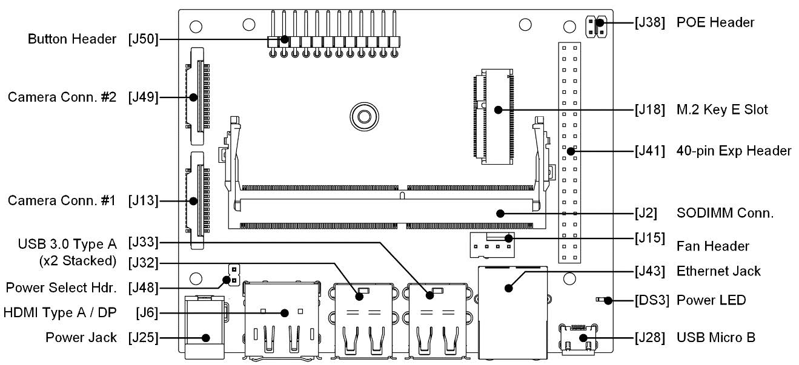
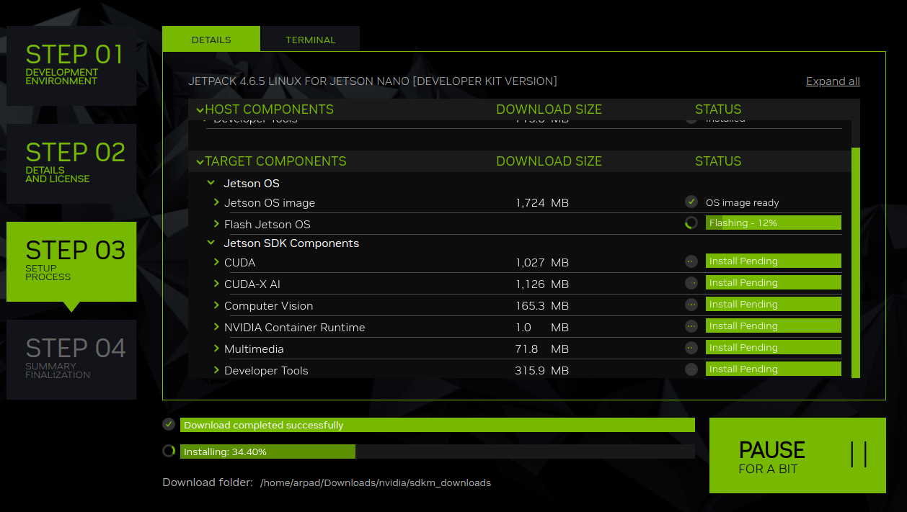
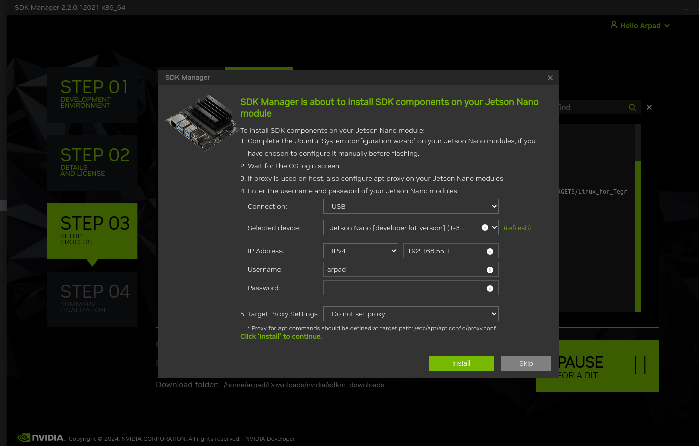
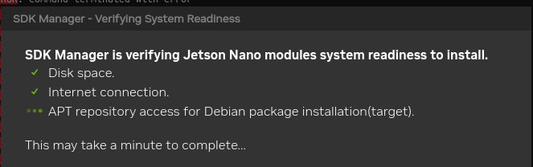
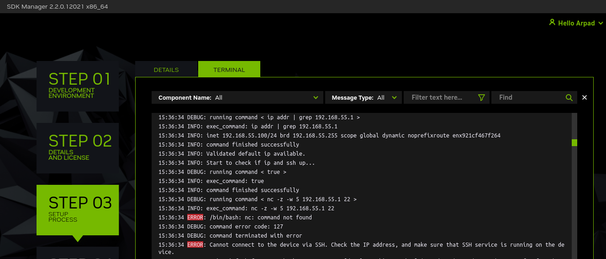

# Beginners Guide to Flashing NVIDIA Jetson Nano

This is meant as a tutorial, mainly for myself. In case I forget.

I was struggling with flashing my old NVIDIA Jetson Nano Development Kit after moving from a slow microSD card (which made it difficult to perform tasks) to a newer / faster one. However, since the old one was traditionally flashed out-of-the-box using the microSD card ([following the official NVIDIA tutorial](https://developer.nvidia.com/embedded/learn/get-started-jetson-nano-devkit), I could apparently not simply re-flash the microSD card and repeat the process.)

I have to put the Jetson Nano into recovery mode and connect to a Linux machine to reflash. There are two options:

1. [Use the CLI for granular flashing (advanced)](https://docs.nvidia.com/jetson/archives/r34.1/DeveloperGuide/text/SD/FlashingSupport.html). Note that you need to find and download the correct `Linux for Tegra` source **for the Jetson Nano** in order to find the proper flashing scripts. E.g. (not guaranteed to work for Jetson Nano) [`Tegra-R2821`](https://developer.nvidia.com/embedded/linux-tegra-r2821)
2. [Use NVIDIA SDK manager (beginner)](https://developer.nvidia.com/sdk-manager)

I went with option (2) since I have never done this before, and it was difficult to read NVIDIA's documentation as a beginner in this space.

## Get NVIDIA SDK Manager

See: [https://developer.nvidia.com/sdk-manager](https://developer.nvidia.com/sdk-manager)

Need to login / create an NVIDIA account to get the `.deb` file. E.g. `sdkmanager_2.2.0-12021_amd64.deb`

## Put Jetson Nano into Recovery Mode

A physical pin needs to be bridged to ground to enter, what is known in the embedded world as, "recovery mode". This essentially means the device's firmware is able to be overwritten.

On the Jetson Nano Development Kit, this is found on the Button Header [J50]. The silkscreen on the bottom of the board should show pins 3/4 which need to be jumped. Different versions of the carrier board and different Jetsons have this pin in different locations, so please check other pin-out diagrams online.



## Other Jetson Nano Peripherals

1. Required: Ethernet (for SDK components)
2. Optional: Mouse, Keyboard, Monitor

## Run NVIDIA SDK Manager from Ubuntu 18.04

This needs to be run inside of Ubuntu 18.04 in order to flash the Jetson Nano directly. Why? I don't know.

If you are on Ubuntu 18.04, then simply `sudo apt install` the deb. Otherwise:

1. Create a `distrobox` instance

    * Needs `usbutils` so that the SDK manager can find the device.
    * Needs the remaining network utils so the SDK manager can SSH into the device later to install Jetson SDK components.

    Create the distro with root priviledges and enter.

    ```bash
    distrobox create --root --image ubuntu:18.04 --additional-packages "usbutils netcat iptables network-manager dnsutils" --name ubuntu18-db
    distrobox enter --root ubuntu18-db
    ```

2. Add as package and install

    ```bash
    sudo dpkg -i sdkmanager_2.2.0-12021_amd64.deb
    sudo apt --fix-broken install
    ```

3. Run

    ```bash
    sdkmanager
    ```

## SDK Manager Steps

Follow on-screen instructions.

This should include logging on, selecting target hardware as Jetson Nano, selecting most recent supported version of Jetpack.

Download all dependencies and create the OS image to flash.

Ensure to select "Manual" mode for first time. Otherwise, "Automatic" mode works fine if the device is powered on and plugged in.



Can plug in monitor while being flashed for sanity. The NVIDIA logo with white background should appear upon completion. This screen will also show up:



Hold off on installing until the configs on the Jetson are installed and it is rebooted (this is when you select `Pre-config` and you can verify the automatic config if plugged into monitor).

Once the Jetson reboots and it is in the login screen, the device has been flashed! ***Remember to remove the recovery mode jumper pin prior to flashing***

It will prompt to install the SDK components. Try SSH'ing into it on another terminal. The IP, Username, and Pwd were all set within the SDK manager. Only after ssh works and confirmed, press `Install`. Given the `distrobox` deps which were installed in the `distrobox` provisioning part, this should yield no error and:



This will just repeatadly ssh into the Jetson Nano and install essentials like CUDA, OpenCV, some DL stuff, etc. This step can be skipped, but not recommended.

## Debugging

Note that if you run into any errors, please see the terminal output for an easy way to debug what is actually going on:



In the image above, you see it can't find `nc` which can be installed using `sudo apt install netcat` on my `distrobox` instance. It could have just directly ssh'ed, but it said it failed because of a missing dependency.

Lastly, if there are any issues during ANY part of this, save the logs or view the terminal output and review. It is likely dependency issues where you will have to re-flash after installing them, or verifying an internet connection.
